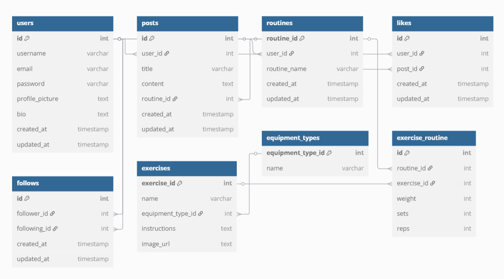

# 💪 FORGED: Next-Gen Fitness Tracker

  
  
  

  

## 🚀 Revolutionizing Fitness Tracking

**Forged** is a ***modern fitness companion*** that helps users track workouts, connect with others, and stay motivated. Built with Laravel 12, it combines powerful tracking with social features in a sleek interface.

## ✨ Key Features

### 🧑‍🤝‍🧑 **Social Fitness Experience**
| Feature | Description |
|---------|-------------|
| **👥 Community Network** | Follow friends, share progress, and have friendly competitions |
| **🏆 Community Advice** | Post your workouts and get real time and honest feed back on them |
| **💬 Activity Feed** | See and interact with posts from people you follow and people from all over the app |

### 🏋️ **Workout Management**
| Feature | Description |
|---------|-------------|
| **📊 Smart Tracking** | Log exercises, sets, reps, and weights with intuitive inputs |
| **📈 Progress History** | History page to see how your strength and endurance improved |
| **🔄 Routine Templates** | Save and reuse your favorite workout plans |

### 💻 **Technical Excellence**
| Feature | Description |
|---------|-------------|
| **⚡ Real-time Updates** | Instant sync across devices without page reloads |
| **📱 Mobile Design** | Perfect experience on all phones |

  <em>...and many more features to supercharge your fitness journey!</em> 🚀

## 🛠 Technology Stack

### **🔧 Core Stack**

| Category       | Technologies                                                                 | Purpose                          |
|----------------|-----------------------------------------------------------------------------|----------------------------------|
| **Backend**    |   | Robust API and server-side logic |
| **Frontend**   |    | Dynamic UI and styling |
| **Database**   |  | Data storage and retrieval |
| **DevOps**     |   | Cloud hosting and CI/CD |

  <em>Engineered for athletes who demand precision and performance.</em> 💪

## 📸 App Preview

  <h3>Experience Forged in Action</h3>
  
  <!-- First Row -->
  <table>
    <tr>
      <td width="50%" align="center">
        
        
<strong>Workout Tracking</strong> Log exercises with precision

      </td>
      <td width="50%" align="center">
        
        
<strong>Community Hub</strong> Connect with fellow athletes

      </td>
    </tr>
  </table>

  <!-- Second Row -->
  <table>
    <tr>
      <td width="50%" align="center">
        
        
<strong>Exercise Library</strong> A plethora of exercises at your fingertips

      </td>
      <td width="50%" align="center">
        
        
<strong>Your Progress</strong> Visualize your fitness journey

      </td>
    </tr>
  </table>

## 🗃️ Database Schema

  <h3>Entity Relationship Diagram</h3>
  
  

  ### 🔑 Core Entities & Relationships
  

    

      

        <strong style="color: #FF2D20;">Users</strong> 👥 
        
Central identity management with authentication and profile data

      

  

        <strong style="color: #4479A1;">Routines</strong> 📅 
        
Workout plans, templates and tracker

      

  

        <strong style="color: #CC6699;">Exercises</strong> 💪 
        
Extensive exercise templete library

      

    

  

      

        <strong style="color: #2088FF;">Posts</strong> 💬 
        
User-generated content and community interactions

      

  

        <strong style="color: #FF6B6B;">Likes</strong> ❤️ 
        
Engagement tracking and social validation

      

  

        <strong style="color: #20C997;">Follows</strong> 🔄 
        
User connections and social interations

      

    

  

  

    <h4 style="margin-top: 0; color: #343a40;">Database Highlights</h4>
    <ul style="columns: 2; column-gap: 30px; font-size: 0.9em;">
      <li>🚀 <strong>Optimized queries</strong> for workout analytics</li>
      <li>🔐 <strong>Secure relationships</strong> with proper constraints</li>
      <li>📈 <strong>Scalable structure</strong> for growing user base</li>
      <li>⚡ <strong>Efficient indexing</strong> on frequent queries</li>
      <li>🤝 <strong>Social features</strong> integrated at database level</li>
      <li>🔄 <strong>Soft deletes</strong> for data integrity</li>
    </ul>
  

  

    "The database powers both real-time workout tracking and social interactions while maintaining strict data consistency across all features."
  

## 🚀 Getting Started

### ⚙️ Prerequisites

Ensure you have these installed:

| Tool          | Version    | Installation Guide                |
|---------------|------------|-----------------------------------|
| PHP           | 8.2+       | [php.net](https://www.php.net/downloads) |
| Composer      | 2.8.8+     | [getcomposer.org](https://getcomposer.org/download) |
| Node.js       | 18+        | [nodejs.org](https://nodejs.org) |
| MySQL         | 8.0+       | [Xampp](https://www.apachefriends.org/) |

### Installation

<pre style="
    display: inline-block;
    text-align: left;
    margin: 0 auto;
    padding: 16px;
    background: #f6f8fa;
    border-radius: 6px;
    font-family: monospace;
    border: 1px solid #e1e4e8;
">
# Clone the repository
git clone https://github.com/theo-picar1/Laravel_Workout_App.git

# Install dependencies
composer install
npm install && npm run dev

# Configure environment
cp .env.example .env
php artisan key:generate

# Set up database
php artisan migrate
php artisan db:seed

# Start development server
php artisan serve

Visit http://localhost:8000 to start using Forged!
</pre>

## 🌍 Live Deployment

  <h3>Now Live on Microsoft Azure</h3>
  
  <a href="https://forged-g3crdrfyb8bwhch5.northeurope-01.azurewebsites.net/" target="_blank" style="display: inline-block; background: #0078D4; color: white; padding: 15px 30px; border-radius: 8px; text-decoration: none; font-weight: bold; margin: 20px 0; box-shadow: 0 4px 12px rgba(0,120,212,0.3); transition: transform 0.2s;">
    🚀 Visit Live Site
  </a>

  

    <h4 style="margin-top: 0; color: #0078D4;">Azure Deployment Details</h4>
    

      

        <strong>Service</strong> 
        Azure App Service
      

      

        <strong>Database</strong> 
        Azure Database for MySQL
      

      

        <strong>CI/CD</strong> 
        GitHub Actions
      

    

  

  

    <h4>Performance Highlights</h4>
    <ul style="text-align: left; columns: 2; column-gap: 40px; font-size: 0.9em;">
      <li>⚡ <strong>99.9% Uptime</strong> SLA</li>
      <li>🌐 <strong>Global CDN</strong> for fast loading worldwide</li>
      <li>🛡️ <strong>DDoS Protection</strong> enabled</li>
      <li>📈 <strong>Auto-scaling</strong> for traffic spikes</li>
      <li>🔒 <strong>SSL Encryption</strong> by default</li>
      <li>📊 <strong>Application Insights</strong> monitoring</li>
    </ul>
  

## 👥 Authors

### Oisin Bell

### Theo Picar

  <em>Let's build a fitter world together! ❤️</em>

